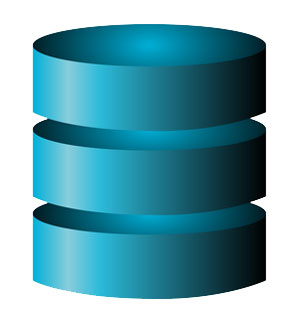
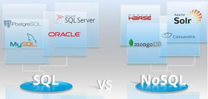
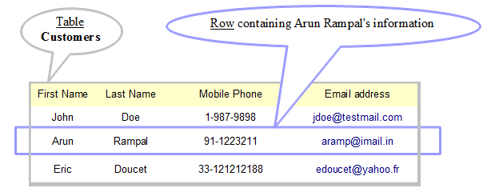
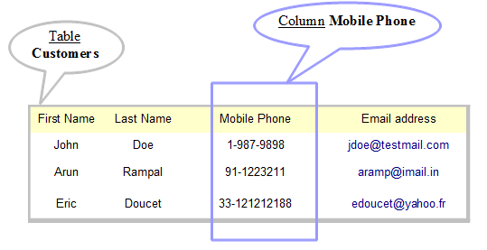

### Read Basics

**Fast track**: In this field, you will learn the most used terms in relation with databases such as **RDBMS**, **SQL**, **Columns** and **Rows**.  
If you are familiar with them, just scan through the section.

#### Goal of a database

Goal of a database: to store data on a way it survives a restart or power off period. It provides the possibility to easily access it from applications. Stored data is often structured based on some logic.

You might heard about these database systems (often called just databases; so when you hear database, it either means the database system, or a specific database storing a collection of data): SQLite, MS SQL (= Microsoft SQL = SQL Server), Oracle PostgreSQL (say: [postgres] or [postgres kju: el]), Oracle, MongoDB, Neo4j, just to mention a few. They are capable of storing the structures and data you want. TOPdesk (the company) uses mainly MS SQL database.

#### Terminology (magic words explained)

* **Relational database (= RDBMS = Relational Database Management System)**  
This is the most prevalent and common type of database (the other category is called non-relational database). It is a type of database that consists of tables, with relations between those tables. Relations are declared on the database level, for example, if there is a table of cats and of owners, then you define the relations: 1 cat belongs to 0 or 1 owner. 1 owner can have 0 to many cats. A database system must fulfill some criteria to deserve the category relational (atomicity, consistency, isolation, durability etc.). SQLite is a relational database.

* **SQL vs. noSQL** makes the same distinction as relational vs. non-relational. SQL is a language of the relational databases, which can be used to get or put data from/to the database, either by a human, or by an application. noSQL stands for „not only SQL”, and is used to describe non-relational databases. noSQL is a category of very different databases, without a common query language. noSQL databases are a very interesting topic, but outside the scope of this workshop.

* **Table** is the main unit of the structure. The table is defined by *columns*. A table has a name.

* **Rows**, **records**: If there is data stored in the table, then they are the *rows* or records of the table. Otherwise it’s empty.  

* A **field** is a value in a specific row and column, but the term is often used as a synonym of column. („What kind of fields does this table have?” „FirstName, LastName etc.”)  

* **unique identifier**, **unid**, **id**: There is often a *unique identifier* field in a table. It is capable to identify a record.

A table structure is created by defining columns, ID, relations to other tables if any, and possibly other settings.

* **CRUD**: Mosaic word for the 4 basic functions of a table:
    * Once a table is created, data can be *inserted* into it. (**C**reate data.)
    * Data can be *read* of it. (**R**ead data.)
    * Rows can be *updated*. (**U**pdate data.)
    * Rows can be *deleted*. (**D**elete data.)

* **Querying**: Reading can be more sophisticated:
    * When reading data, rows can be filtered by conditions, and can be sorted.
    * When reading data, columns to show can be selected.

#### SQL (Structured Query Language)

Creating, querying a table are done by executing some magic command in a magic tool, and then they are stored at a magic place. In the simplest case:

 * The magic commands are written in **SQL** language.
 * A handy way to run queries is a SQL client such as [SQLite View online App](https://www.sqliteview.com/app), [Letos](https://letos.org/) or [DB Browser for SQLite](https://sqlitebrowser.org/).
 * The magic place is on a database server, which is configured in the magic tool. With SQLite, this can be on your own file system or even in the browser.

The term SQL is often used in a context of **SQL script**: the commands can be saved into a file with .sql extension, which can be executed by the tool on the server.

**Database client** is a broader term for applications that can manipulate data or data structures. It can be a tool like [Letos](https://letos.org/), or an application that compiles SQL statements in the background and runs them automatically.
