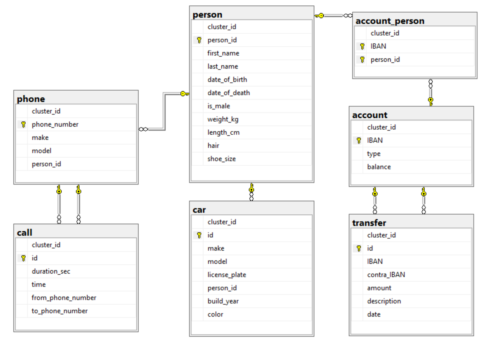
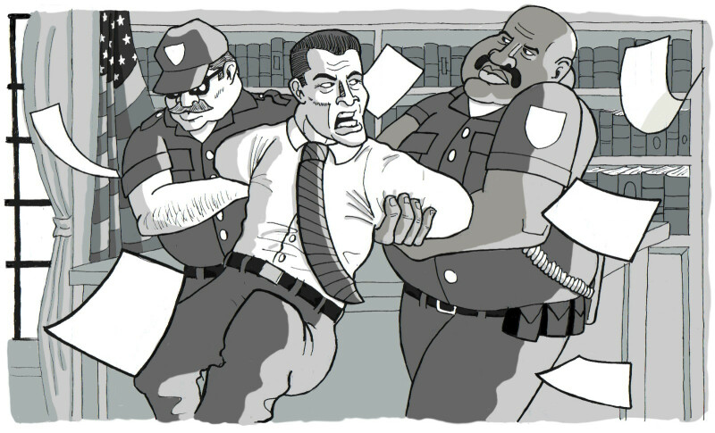

### Complex joins

**Fast track**: In this field, you will have to deeply think to figure out the query with multiple joins to solve the mystery.  
If you are on the fast track, just read the story, understand the relations between the tables, and think a bit about how would you join the tables to get the solution. Then compare it with the suggested solution, which you should execute in your database. 

> Our story continues...
>
> The police are interrogating Mr. Patrelli, a politician running for a seat in the US congress.
> Financial records found by the police, indicated that Mr. Patrelli 
> made a number of large transfers to the victim.
> 
> Mr. Patrelli was brought in for questioning.
> Anderson: "Do you see this list of transactions? They were made from your account.
> But the receiver is dead! Now start talking!"
> Patrelli didn't crack. "Vern did some work for me to do some opposition research 
> for my campaign. Basically he worked for me as a private investigator. 
> That's why I paid him, and I wanted to keep it quiet.
> But it's not illegal, so what?"
> - "So what? Now Vern is dead. Don't you think that is suspicious?"
> - "Suspicious? You've got nothing. Either charge me with something, or leave me alone!"
> - "Hot headed, are we, Mr. Patrelli?"
> Just as the shouting reached new heights, Mr. Patrelli was 
> interrupted by the Sony ringtone originating from his pocket. Strange,
> normally people brought for questioning were asked to leave their phone with the guard at the entrance. 
> An oversight? No, apparently Patrelli was carrying two phones. 
> He conveniently forgot to mention the second one when he handed in the first.
>
> The questioning went on for a little while longer, and Patrelli's behaviour seemed very suspicious.
> But there is not enough to build a case. 
> Perhaps, if we could establish a motive, we could press the case. 
> But there was no conceivable motive. Why would Patrelli want to hurt Vern?
> And why would somebody carry two mobile phones?
>

**Prerequisite**: Make sure you are still connected to the database which is already prepared for you. If unsure, refer back to: [Connect to your database](../intro-street/connect-to-your-database.md).

<details>
  <summary>Whenever you need to remember the entity relations, check out the Entity-Relationship Diagram here.</summary>
  <p>
  <a href="images/dba_detective_database_structure.png"></a>
  </p>
</details>

<!-- blank line -->
----
<!-- blank line -->

**Exercise 1**: Write a query to find out which phones are owned by Mr. Patrelli. (Note, this one is not yet too difficult, it involves only two tables). Which are Patrelli's phones? Do we have a record for the Sony?

<details>
<summary>Solution</summary>

He has 2 phones in the database, 1 of them is a Sony.

<!-- sql-test: rows=2 -->
```sql
SELECT *
FROM phone AS ph 
JOIN person AS p ON p.person_id = ph.person_id
WHERE p.first_name = 'Peter' AND p.last_name='Patrelli'
```
</details>

<!-- blank line -->
----
<!-- blank line -->

**Exercise 2**: Write a single query to find out who last called Peter Patrelli on his Sony phone (without using the phone id explicitely in the query).

**Hints**:

* To find the latest call, simply order the result by the time of the call using the `ORDER BY` keyword.
* The call table has two foreign key relationships with the phone table. This means you will need to join twice with the same table, and you have to define an alias using the `AS` keyword, to be able to distinguish the two. Previously, you have been using `AS` for convenient shortcuts. Here it is essential.
```sql
SELECT * FROM call c
JOIN phone AS p1 ON p1.some_field = c.other_field
JOIN phone AS p2 ON p2.some_field = c.another_field
```

<details>
<summary>Solution</summary>

<!-- sql-test: rows=1 -->
```sql
SELECT c.time, c.to_phone_number, c.from_phone_number, from_person.first_name as from_first_name, from_person.last_name as from_last_name, to_person.first_name as to_first_name, to_person.last_name as to_last_name
FROM call AS c
JOIN phone AS fph ON fph.phone_number = c.from_phone_number
JOIN phone AS tph ON tph.phone_number = c.to_phone_number
JOIN person AS from_person ON from_person.person_id = fph.person_id
JOIN person AS to_person ON to_person.person_id = tph.person_id
WHERE to_person.first_name = 'Peter' AND to_person.last_name='Patrelli'
AND tph.make = 'Sony'
ORDER BY time DESC
LIMIT 1
```
</details>

<!-- blank line -->
----
<!-- blank line -->

**Exercise 3**: Who should the police call to the station for investigation?

<details>
<summary>Solution</summary>
Ellie Burgess
</details>
<br />

>
> From the phone records of Mr. Patrelli's second phone, an interesting new connection emerged.
> He frequently had calls with a seemingly unrelated woman.
> When confronted with these facts, he became angry. "You've got nothing but vicious rumours", he said.
> "No, what we've got is probable cause!", Dick retorted. "You're coming with us to the station! Officers, take him away!" 
> 
> 
> 
> Later, back at the precinct he broke down. "Yes it's true, I had an affair. 
> Ellie is a teacher, Vern's teacher actually. Vern maybe had a little crush on her. 
> He must have followed her, and then he found out about us."
> He threatened to go to the press. It would have ruined my carreer. He wanted money. I gave it to him,
> but he kept wanting more. In the end, I saw no other way."
> 
> Congratulations, you solved another murder!
>