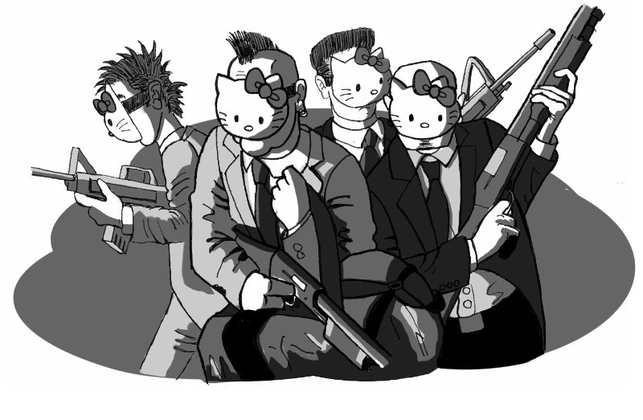
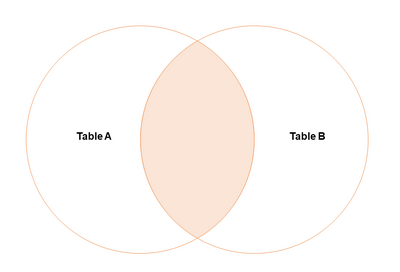
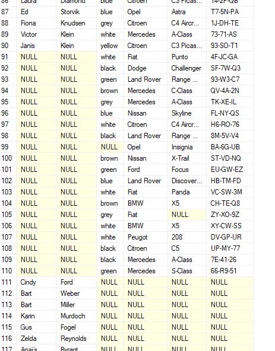
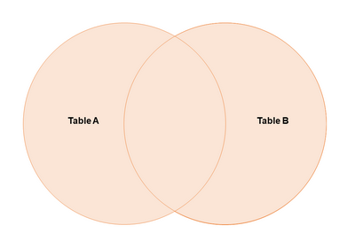
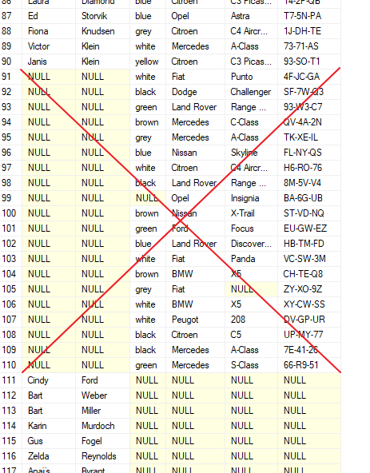
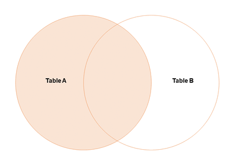
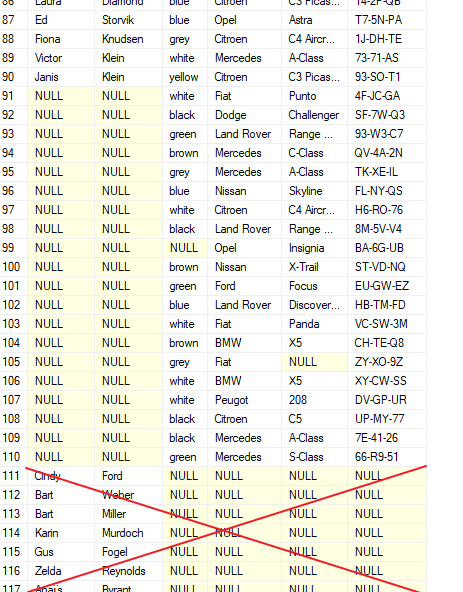
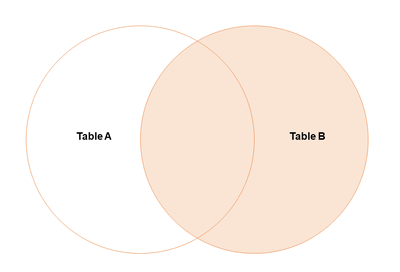

### Simple joins

**Fast track**: In this field, you will learn how police database guys join multiple tables (`INNER JOIN`, `LEFT JOIN`, `RIGHT JOIN`, `FULL JOIN`/`FULL OUTER JOIN`), and you can practice it via a lot of examples. Additionally, you can practice `ORDER BY` and partial search (`LIKE`) here.
If you are on the fast track, just check out the story line, and read the exercises, figures and solutions to track the story.

> Chapter 2: The Getaway Vehicle
> ------------------------------
>
> A violent robbery at the National Bank branch on 7th street.
> Dick gets the call at 9:56 AM. So nice when criminals work during office hours.
> When he arrives, Simmons is already at the crime scene. Simmons brings him up to speed.
>
> "At 9:35 AM, a group of men wearing Hello Kitty masks entered the bank,
> carrying assault weapons. They demand to enter the vault, by threat of violence. The private
> security guard present triggered the alarm, and tries to stall for time, 
> hoping for the police to arrive on the scene. Unfortunately
> the robbers see through the ruse. They get into an argument, 
> and ultimately the guard gets shot. He later died in the
> ambulance on the way to the hospital."
> 
> Dick cursed under his breath. Poor man was just doing his job.
> It was paramount to get these trigger-happy nut-jobs locked away for a very long time.
> 
> Simmons continued "Not encountering any further opposition, the thieves quickly proceed 
> to empty the vault carrying an estimated 750 thousand dollars in cash and valuables 
> away in a matter of minutes".
> 
> "Any witnesses saw where they fled?" Dick asked. "Yes, a few. 
> People on the sidewalk at the time, reported the perps fled the crime scene
> in a blue Mercedes towards the east river bridge."
> 
> 
>


**Prerequisite**: Make sure you are still connected to the database which is already prepared for you. If unsure, refer back to: [Connect to your database](../intro-street/connect-to-your-database.md).

#### Inner joins

A basic join is what is also called an `INNER JOIN`. This means that you only find rows
where there is a match in both tables.

**Exercise 1**: Write a query that lists the cars with the full name of the owners. The result of the query should look somewhat like this (the actual data might be different):

| first_name | last_name | color | make | model | license_plate |
| -------- | -------- | -------- | -------- | -------- | -------- |
| Otto  | Brown   | blue | Audi | A7 | 99-AA-BB |
| Cliff | Diamond | red | Fiat | 500 | 22-CC-DD  |
| Ben   | Murray  | white | Opel | Corsa | 33-QQ-ZZ |

**Hints**:

* A usual visual representation of the inner join is this:



* You can get the results of two tables in one result set by using a `JOIN`. The basic form of a `JOIN` is as follows:
```sql
SELECT * FROM table1 JOIN table2 ON join_condition.
```
* Most commonly, the `JOIN` condition makes use of a foreign key relationship.
```sql
SELECT * FROM table1 JOIN table2 ON table1.primaryKey = table2.foreignKey
```
* You can use aliases to avoid having to type the same table name over and over again.
```sql
SELECT * FROM table1 AS t1 JOIN table2 AS t2 ON t1.primaryKey = t2.foreignKey
```

<details>
<summary>Solution</summary>

<!-- sql-test -->
```sql
SELECT p.first_name, p.last_name, c.color, c.make, c.model, c.license_plate
FROM person AS p
JOIN car AS c ON p.person_id = c.person_id
```
</details>

| **Note**    |
| ----------- |
| Tables are interchangeable: `FROM car JOIN person` results in the same result set as `FROM person JOIN car` |

<!-- blank line -->
----
<!-- blank line -->

**Exercise 2**: Now make a list of cars matching the description of the getaway vehicle, including the car owners. So find the owners of blue Mercedeses.

<details>
<summary>Solution</summary>

<!-- sql-test: rows=2 -->
```sql
SELECT p.first_name, p.last_name, c.color, c.make, c.model, c.license_plate
FROM person AS p
JOIN car AS c ON p.person_id = c.person_id
WHERE make = 'Mercedes' AND color = 'blue';
```
</details>

>
> One bystander even caught a glimpse of the license plate. He wasn't sure completely, but at least he was certain that the plate starts with '66'. 
>

<!-- blank line -->
----
<!-- blank line -->

**Exercise 3**: Add a condition to your query to also filter by partial license plate

**Hint**:

* You can look for partial string matches with the `LIKE` keyword, using the percent sign (`%`) as a wildcard. It can be used to replace any parts of the text:
```sql
SELECT c.color, c.make, c.model, c.license_plate FROM car c
WHERE license_plate LIKE '5%'
```
```sql
SELECT c.color, c.make, c.model, c.license_plate FROM car c
WHERE license_plate LIKE '%1'
```
```sql
SELECT c.color, c.make, c.model, c.license_plate FROM car c
WHERE license_plate LIKE '5%1'
```
```sql
SELECT c.color, c.make, c.model, c.license_plate FROM car c
WHERE license_plate LIKE '5%VI%1'
```

<details>
<summary>Check your results</summary>
<p>
0 result.
</p>
</details>

<details>
<summary>Solution</summary>

<!-- sql-test: rows=0 -->
```sql
SELECT p.first_name, p.last_name, c.color, c.make, c.model, c.license_plate 
FROM person AS p
JOIN car AS c ON p.person_id = c.person_id
WHERE make='Mercedes' AND color = 'blue' AND license_plate LIKE '66%'
```
</details>

>
> Initial search of the police database didn't result in an owner for the blue Mercedes with partial license plate '66-??-??'.
> It looks like this lead is a dead end. Or is it? Maybe we need to broaden our search a little...
> 
> If the car was not registered to a person then it was probably a taxi or a rental, 
> most likely a rental from 'Quartz rental Co.', according to the witnesses' description.
>


#### Join types

Sometimes, you are interested in results from one table where there is no corresponding result in the other table. This may happen when the foreign key column has null values. For example, it may be that a car does not have a registered owner (for example, it is a company car or a rental). In these cases, the person_id column in the Car table is `NULL`. To check if one of these cars matches the description, we will do an outer join (`FULL JOIN` or `FULL OUTER JOIN`).

**Exercise 4**: Write a query that lists all people together with their cars if they have, or without car if they don't have. Also include the cars without an owner in the list, if the car doesn't have an owner. It should look somewhat like this:
 


**Hints**:

* This is a typical `FULL JOIN`: both sides are included, even if there is no relation to the other table. This has not much use case in the real life.



* Once you get the solution, scroll over the result set, and look at the groups of rows: the first group is where there are cars and people linked to each other; the second group is where there is no owner to the car; and the third one is where the person has no car.

<details>
<summary>Solution</summary>

<!-- sql-test -->
```sql
SELECT p.first_name, p.last_name, c.color, c.make, c.model, c.license_plate
FROM person AS p
FULL JOIN car AS c ON p.person_id = c.person_id
```
</details>
<br />

<!-- blank line -->
----
<!-- blank line -->

**Exercise 5**: Adjust the query to list all people together with their cars if they have, or without car if they don't have. But don't include the cars having no owner. It should look somewhat like this:



**Hints**:

* If you start searching from the person table, then this is a `LEFT JOIN`, as everything is included from the left table (even if they have no relation with the right table).



* `LEFT JOIN` is asymmetrical: the order of the tables (i.e. `FROM car LEFT JOIN person` or `FROM person LEFT JOIN car`) does matter. Not like in case of `INNER JOIN` or `FULL JOIN`.

<details>
<summary>Solution</summary>

<!-- sql-test -->
```sql
SELECT p.first_name, p.last_name, c.color, c.make, c.model, c.license_plate
FROM person AS p
LEFT JOIN car AS c ON p.person_id = c.person_id
```
</details>
<br />

<!-- blank line -->
----
<!-- blank line -->

**Exercise 6**: Adjust the query to list all people together with their cars if they have, but don't include people without a car. Include the cars having no owner. It should look somewhat like this:



**Hints**:

* If you start searching from the person table, and car table is joined, then this is a `RIGHT JOIN`, as the everything is included from the right table (even if they have no relation with the left table).



<details>
<summary>Solution</summary>

<!-- sql-test -->
```sql
SELECT p.first_name, p.last_name, c.color, c.make, c.model, c.license_plate
FROM person AS p
RIGHT JOIN car AS c ON p.person_id = c.person_id
```
</details>
<br />

<!-- blank line -->
----
<!-- blank line -->

**Exercise 7**: Make an equivalent query by using a `LEFT JOIN`.

<details>
<summary>Solution</summary>

<!-- sql-test -->
```sql
SELECT p.first_name, p.last_name, c.color, c.make, c.model, c.license_plate
FROM car AS c
LEFT JOIN person AS p ON p.person_id = c.person_id
```
</details>

<!-- blank line -->
----
<!-- blank line -->

**Exercise 8**: Now let's put it all together. Query for all cars (with or without owner), and include the filters for partial license plate, make and color.

<details>
<summary>Solution</summary>

<!-- sql-test: rows=1; license_plate=66-B4-79 -->
```sql
SELECT p.first_name, p.last_name, c.color, c.make, c.model, c.license_plate FROM person AS p
RIGHT JOIN car AS c ON p.person_id = c.person_id
WHERE make = 'Mercedes' AND color = 'blue' AND license_plate LIKE '66%'
```
</details>

<!-- blank line -->
----
<!-- blank line -->

**Exercise 9**: Does the getaway car have a registered owner?

<details>
<summary>Solution</summary>
Answer: no, it is a C-class Mercedes with license plate 66-B4-79 but without an owner.<br>
</details>
<br />

**Note**:

* There is another form of join, a kind of "manual" one:
```sql
SELECT p.first_name, p.last_name, c.color, c.make, c.model, c.license_plate
FROM car AS c, person AS p
WHERE p.person_id = c.person_id
```

> More details about the getaway vehicle have emerged, but it has so far not pointed to
> any suspect.
>
> Now that we know this was a rental car, maybe we can find some more information in 
> financial records. Maybe the credit card used to rent that car leads to a suspect.
>

<!-- blank line -->
----
<!-- blank line -->

**Exercice 10**: Examine the 'Transfer' table. Look for records that have 'rental' in the description.

**Hints**:

* Don't forget to use the `LIKE` keyword for partial text matches.

<details>
<summary>Solution</summary>

<!-- sql-test -->
```sql
SELECT * 
FROM transfer 
WHERE description LIKE '%rental%';
```
</details>

<!-- blank line -->
----
<!-- blank line -->

**Exercice 11**: Based on the patterns, can you adjust the filter for the exact financial records related to this car?

<details>
<summary>Solution</summary>

<!-- sql-test -->
```sql
SELECT * 
FROM transfer 
WHERE description = 'Car rental 66-B4-79'
```
</details>

<!-- blank line -->
----
<!-- blank line -->

**Exercise 12**: Now join the financial records related to the car with the owner of the account.

**Hints**:

* Joins are not limited to two tables, you can do a join with three, four etc... tables.
* The general pattern in three table joins is `SELECT FROM a JOIN b ON condition1 JOIN c ON condition2`
* The relation between transfer and person goes via the account_person table. This is a many-to-many relation. So you will need to do a join from transfer to account_person, followed by a join from account_person to person, together in one query.

<details>
  <summary>See the model here</summary>
  <p>
  
  </p>
</details>

<details>
<summary>Solution</summary>

<!-- sql-test: rows=14 -->
```sql
SELECT t.*, p.first_name, p.last_name 
FROM transfer t 
JOIN account_person ap ON t.IBAN = ap.IBAN 
JOIN person p ON ap.person_id = p.person_id 
WHERE t.description = 'Car rental 66-B4-79'
```
</details>

<!-- blank line -->
----
<!-- blank line -->

**Exercise 13**: We want to find the very last person who rented this car, from the financial records.

**Hints**:

* You can use the `ORDER BY` clause at the end to choose which field to order on like so: `SELECT ... WHERE ... ORDER BY sort-field`
* By default, the data is sorted in ascending order, to sort descending, use the `DESC` keyword like so: `SELECT ... WHERE ... ORDER BY field DESC`

| **Note**    |
| ----------- |
| You can make it even nicer by adding `TOP 1` to only show the record with the highest date. |

<details>
<summary>Check your results</summary>
<p>
Bart Hawking is on the top of the results.
</p>
</details>

<details>
<summary>Solution</summary>

<!-- sql-test: first_name=Bart; last_name=Hawking -->
```sql
SELECT t.*, p.first_name, p.last_name 
FROM transfer t 
JOIN account_person ap ON t.IBAN = ap.IBAN 
JOIN person p ON ap.person_id = p.person_id 
WHERE t.description = 'Car rental 66-B4-79' 
ORDER BY DATE DESC
```
</details>

<details>
<summary>Solution with top 1</summary>

<!-- sql-test: rows=1; first_name=Bart; last_name=Hawking -->
```sql
SELECT TOP 1 t.*, p.first_name, p.last_name 
FROM transfer t 
JOIN account_person ap ON t.IBAN = ap.IBAN 
JOIN person p ON ap.person_id = p.person_id 
WHERE t.description = 'Car rental 66-B4-79' 
ORDER BY DATE DESC
```
</details>

>
> There was an eerie silence - the silence before a storm.
> Sargeant Reynolds crouched with his SWAT team outside the door 
> of a delapidated suburban dwelling.
> He mimed directions to his agents. Holding his hand up high, 
> he silently counted down with his fingers. Three, two, one, zero. 
>
> Boom! 
>
> Agents busted the door of the hide-out and poured inside.
> 
> - They're over here!
> - Down on the ground! Down on the ground!
> - Show me your hands!
> 
> Using the credit card linked to the rental car, the police had 
> tracked down the home address of one of the gang members. 
> They had quietly observed the place for a few
> weeks until the right moment came: a moment when they knew that all 
> gang members were there. And it worked! They apprehended all four, 
> and found plenty of evidence linking them to the crime. 
> The money. Fingerprints. Guns, including the one used to kill the bank guard.
>
> And the masks. And not only masks, there was a whole collection of 
> Hello Kitty memorabelia and merchandise. Pluche toys, pens, stickers, plastic cups, 
> a label writer. Apparently one of these gangsters was obsessed with them.
>
> It takes all kinds to make a world...
>
> Dick was in a good mood for once. These crooks will be in the slammer for a long time. 
> Perhaps they'll have some time to rethink their life choices... 
>
