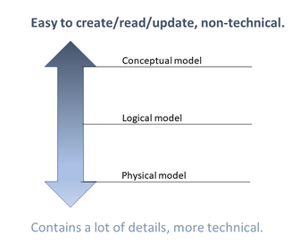
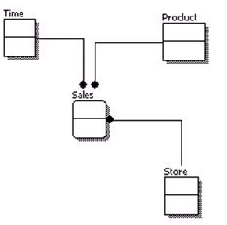
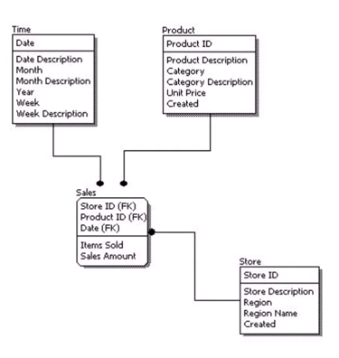
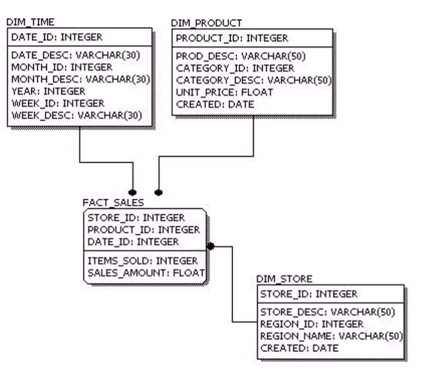
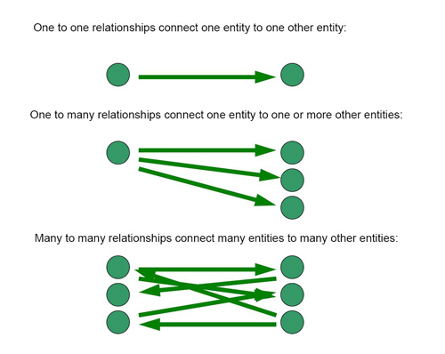

### Data modeling

**Fast track**: In this field, you will read about data modeling, i.e. how to break down the user requirements to diagrams, which can then be converted to a database. We introduce terms like **entities**, **relations** to show examples on how to make **entity-relationship diagrams** on different levels of details. You will also read about different types of relationships.  
You can save time by reading it fast, just to get a grasp of what these terms are.

**Exercise**: Read about data modeling, as we will follow this path to implement the database structure in MS SQL on the next field.

#### Entities and relations
From the business needs we can easily get to the database structure via an entity-relationship model (ER model). How?

We need a model, which reflects to the business needs. More specifically, we need an *entity-relationship model*. It contains the basic information about the business domain:

* *entities*, which are definable objects with attributes and
* *relations* between them.

For example, if the *business domain* is to track cars of owners, then the entities are: 
owners, cars; and the relation between them: [an owner] 'has' [a car]. An entity can have 
attributes like age or weight etc. A relation can be marked with numbers: how many belongs 
to how many (1 or many). It has a direction. Both sides of the relation can be marked with 
'can be zero' or not. If it has to be more than one, then it is mandatory. If 0 is allowed, 
then we say it is nullable.

The most natural approach to make a model is to draw a figure. 
A nice diagram type for this purpose is the *Entity-relationship diagram (ERD)*. 
We'll look at examples, implement our own diagrams, and finally we'll end up in a database structure. 

There are 3 stages of an ERD, and it depends on the situation (like for example talking with the customer, dev team huddle, showing the database structure), which one is the best fit.

| **Note**    |
| ----------- |
| Different sources describe these models slightly differently. So it's not set in stone. |

 
*1. Conceptual*:

* List of square shapes (representation of entities) and lines (representation of relations).
* Easy to understand, or to draw on a white board, or to update; but holds only basic information.

*2. Logical*:

   * List of attributes to every entity, including an identifier (ID).
   * An attribute is either key or non-key attribute. If the attribute is unique, it is a key attribute (ID); every other attribute is a non-key attribute. Key attributes are above the line, non-key attributes are below the line.
   * Primary keys are defined to identify entities. It ensures uniqueness, and non-null values. There can be only 1 primary key in a table.
   * Foreign keys are defined to make relations between columns of tables. If car.person_id is valid only if it is included in the person table as an id, then create a foreign key reference in the car table to the person.
   * Possible number of connections is included on both ends of the relation arrows. (Not like on the attached figure. :) ) 
      * A connection arrow between person and car showing (2)---(1) on the ends means that "1 person has 1 car", and "1 car belongs to 2 people".
      * A connection arrow between person and car showing (2)---(*) on the ends means that "1 person has any number of cars", and "1 car belongs to 2 people".
   * Put a 0 next to the number, if 0 is also allowed.
   * Tool can be used to create it.

*3. Physical*: Database specific implementation of the model.

* Tables, columns, data types, default values are defined.
* Precise, but hard to understand for users.

#### Relationship types

See the references below for more explanation and examples.

Typical relations:
"has", "can have", "working on", "uses", "creates", "belongs to" etc.

*References*:  

* [Conceptual, Logical & Physical Data Models on Youtube](https://www.youtube.com/watch?v=RJ9TpkWKyU0)
* [More information from a book on database design](https://port.sas.ac.uk/mod/book/view.php?id=75&chapterid=140)
