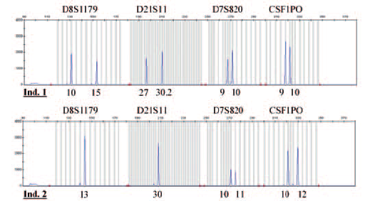

### Practice database design

**Fast track**: In this field, you will create a logical model (an entity-relationship diagram) based on user requirements. Then you will convert it to a physical model, and for that, you will learn how to implement different relationship types in a database.  
If you are familiar with these, just read the story line, the framed notes, the exercises and the solutions including the diagrams.

> Anderson stamped back into his office, big thunderclouds above his head. He had just returned from the courtroom. It had been a difficult case. He knew he shouldn't let it affect him, but the case ate him up inside. A brutal serial killer. A month-long desparate hunt for scraps of clues leading to a suspect. And ultimately, only one thing to link the suspect to the killings: DNA from a tiny skin sample from under one of the victims nails.

> Reasonable doubt. That's what it came down to. The judge had been clear: the job of each juror is to ascertain beyond a reasonable doubt that the suspect was guilty. And some jurors still had doubts. And so the suspect walked.

> The defense attornies had done a beautiful job to confuse the jury. They had drummed up a forensic expert. A real piece of work this guy was. Tweed jacket, bow tie, a real professor type. He had talked at length about copy number variations, homozygous alleles and more such mumbo jumbo. But the final conclusion was: they needed 20 matching data points. They only had 5.

> Anderson had to admit to himself, the professor had a point. DNA fingerprinting was still new at the department. All the records are a complete mess. It's those damn database guys again. Why don't they do their job properly? How hard can it be to store a bunch of DNA fingerprints in a database?

For the coming exercises, we are going to design a database for the DNA Fingerprinting *business domain*. This business domain is probably unfamiliar to you as a developer, so take a moment to familiarize yourself with the terminology.

------

DNA fingerprinting starts with a sample. It can be a spat of blood, a hair, a bit of skin. The sample can come from a known person of interest, such as a suspect, a family member, or a victim. But it can also be from a crime scene, in which case the person is unkown.

A sample is processed in a laboratory. The resulting fingerprint typically looks something like the figure below. The word fingerprint is used figuratively here, it has nothing to do with greasy fingers! 

In the figure above, you see partial fingerprints from two persons (Individual 1 and Individual 2). They look like a series of (blue) peaks. Grey vertical lines show the possible peaks that exist in the entire population.

The fingerprint is taken from standard bits of DNA, called loci (singular: locus). The loci have been selected for their variability from one person to another. Their variability is ideal for fingerprinting. Loci have names such as D8S1179 or CSF1PO - the meaning of these names is not important.

The figure shows only four loci: D8S1179, D21S11, D7S820 and CSF1PO. A full fingerprint contains at least 20 loci. That is the legally mandated minimum to be acceptable as courtroom evidence. 

Each locus will have one or two peaks. For example, if you look at the figure for individual 1 at locus D8S1179, you see that there are two peaks at 10 and 15. For individual 2, there is only one peak at 13. That's because your DNA is a mix from your father and your mother. The peak from both your parents could be the same, coincidentally, so it shows up as just one peak. If the peaks are the same for both parents, they are called homozygous, otherwise heterozygous.

The peak numbering is independent for each locus. Individual 1 happens to have the same peak numbers (9, 10) at loci D7S820 and CSF1PO, but this is pure coincidence!

------

**Exercise 1**: 

We're going to start our database design process by creating a *conceptual model*. The primary purpose of our database will be to quickly match a new DNA sample from a crime scene to one of the samples collected in the past, from volunteers, criminals, or unidentified samples from other crime scenes.

1. Determine *entities* for a DNA finger printing database, based on the rules of the *business domain* described above.
2. Determine the relations between different entities, and their *cardinality*. Are they one-to-one? one-to-many? many-to-many?
3. Finally, draw the conceptual model. You can do this with pen and paper, or you could use a tool like [app.diagrams.net](https://app.diagrams.net/). 

**Hints**:

* Refer to the explanation of a conceptual model in [Data modeling](data-modeling.md). Remember, a conceptual model only has entities and their relationships, details about the entities are not needed yet.
* The entities are more or less the nouns of a business domain. Although sometimes different nouns can refer to the same entity.
* Thinking about the cardinality of a relationship can help to clarify the role of entities. If there is a one-to-one relationship between two entities, could they instead be modeled as a single entity that captures both?

  
A possible solution

  

  Keep in mind that there is never a single, perfect solution for a database design.
  Designing will always involve trade-offs between query capabilities, performance considerations, and how easy it is to keep the data up-to-date.
  

  Having said that, a good solution would probably include the following entities:
  

  

  'locus, 'peak', 
  'sample' and/or 'fingerprint', and 'person'
  

  
  
  

  
  Here are some considerations.
  

  <ul>
  <li>It's standard practice to refer to entities in <i>singular</i>.
  </li><li>
  The 'sample' entity could represent a single DNA sample taken at a certain time and place. A sample may be for a person. But the person could be unknown, in which case we can set that relation to NULL.
  </li><li>
  The concepts 'Sample' and 'fingerprint' are closely related. Analysing a sample should always result in the same fingerprint. So they could be represented by one entity. Theoretically, if a sample results in different fingerprints then your forensic lab is making mistakes. If your purpose is to do quality control on your forensic lab, then it might be useful to track them separately. But we're mostly interested in searching for matches to our crime scene sample, so we can simplify our conceptual model, and make do with just a single entity representing both concepts.
  </li><li>
  'Homozygous' and 'heterozygous' aren't useful entities. One clue is that these words are used as adverbs or adjectives, not nouns. Furthermore, matching on peak number is sufficient to find fingerprint matches, the homozygous / heterozygous label is not needed for that. It's a bit of a red herring.
  </li><li>
  'Victim' or 'suspect' are not useful entities here, because they can be seen as synonyms of 'person'. If you did introduce a victim or suspect entity, it would have a one-to-one relationship with a person.
  </li><li>
  How do we capture peaks? One way to think of this is that a particular sample contains 20 sample-locus-combinations, and each combination can have 1-2 peaks. But another way to think about this is that a particular sample contains between 20 and 40 peaks (cutting out the middle man, so to speak). Both designs are possible. In practice, the latter is easier to implement because it's one less entity to worry about, and one less join to put in your queries. But a potential advantage of keeping the in-between sample-locus-combination as an entity in its own right, is that it would be easier track the homozygous or heterozygous properties. 
  </li><li>
  What are the cardinalities of the relationships? Each person can have many samples, and a sample can belong to 0 or 1 persons. Many measurements correspond to the same sample, many measurements correspond to the same locus. In relational database design, cardinality is counted zero, one, and many. There is no way to force an upper limit of 2, or 20, or 40.
  </ul>

  But again, there is not one true answer, feel free to discuss alternatives with your course instructor.

 

<!-- blank line -->
----
<!-- blank line -->

**Exercise 2**: In the next step, we create a 
''logical model'' out of the entities and the relations. Think about which data you need to store for each entity. What properties does each entity have? Do you need to store labels? Timestamps? Remarks? What information could be useful for searching DNA fingerprints? Again, draw a figure on paper - or use diagram software.

**Hints**:

* Not all entities need to store a lot of data fields! Sometimes an entity is purely defined through the relationships with other entities.

One solution

  

Some explanation:

<ul><li>
If you want to categorize samples coming from blood, skin, etc. then it might even be useful to construct a 'source' entity, to standardize all the possible different sources. But it might be hard to standardize all the possiblities that agents find in the field, so a free text field makes sense too.
<li></li>
There is a lot of information one can store about a person. Name, date of birth, address, telephone, email, favorite color... Here we restrict ourselves to first name, last name, and date of birth. Somebody who has to look up people all day (a dentist receptionist for example) tends to start with the date of birth, because names are easy to misspell.
</li></ul>

<!-- blank line -->
----
<!-- blank line -->

**Exercise 3**: Convert the logical model into a physical model. In the physical model, we have to concretely define Primary Keys and Foreign Keys. We should think if fields may be NULL or not. We also have to think about the data type of each field: is it a number field, a text field (and how long), or perhaps a date field? This is the last step before we can actually start feeding SQL statements to create tables.

| **Note - Usual implementation of a *1* to *1* relationship type:**    |
| ----------- |
| If *A* has one *B*: include id of *B* in table *A*. | 

| **Note - Usual implementation of a *1* to *n* relationship type:**    |
| ----------- |
| If *A* has many *B*-s: include id of *A* in table *B*. Table B has a foreign key that points to the primary key of table A. | 

| **Note - Usual implementation of an *n* to *n* relationship type:**    |
| ----------- |
| If *A* has many *B*-s, and *B* has many *A*-s: cannot be achieved by just having these 2 tables. A so-called *link table* is needed, containing the ids of both *A* and *B* (and an own id). | 

**Hints**: 

* See an example of an *n* to *n* relationship:
  * A has records like a1, a2, a3.
  * B has records like b1, b2.
  * These are the relations: a1-b1, a1-b2, a2-b2, a3-b2.
  * These records in the link table describe the mentioned relations:  

	| id  | idA | idB | 
	| --- | --- | --- |
	| 1   | a1  | b1  |
	| 2   | a1  | b2  |
	| 3   | a2  | b2  |
	| 4   | a3  | b2  |

* Use the description of the physical model and the examples shown in [Data modeling](data-modeling.md).
* The physical diagram will be mapped directly to the database. It is the database structure.
* Relations to other tables become id columns containing the reference to the other tables, and are specifically between 2 columns.

One solution

  

<ul>
<li>
Databases prefer numbers (ints) as identifiers, for perfomance reasons. So a locus name like D8S1179 does not make for a good identifier. Here we store the locus name in a column. Later we will add a constraint that the names must be unique.
</li><li>
We allow many fields in the sample table, such as the source and collection date, to be NULL. Agents in the field may not always be able to fill every piece of data accurately from the start.
</li><li>
person -> sample is a zero-to-many relation in this model, so sample table contains a person_id that may be NULL.</li>
<li>sample -> peak is a one-to-many relation in this model, so peak contains a sample_id (NOT NULL). </li>
<li>locus -> peak is also a one-to-many relation, so peak contains locus_id (NOT NULL)</li>
<li>In this physical model, the locus entity is rather empty, it's just a table of ids. It's a valid question to ask if we need a locus table at all. But a locus table could still be helpful to enforce the validity of locus_id in other tables.
</li>
</ul>

| **Note**    |
| ----------- |
| If you're curious about the world forensics and DNA fingerprinting, have a look at CODIS on [Wikipedia](https://en.wikipedia.org/wiki/Combined_DNA_Index_System) or on the [FBI Website](https://www.fbi.gov/how-we-can-help-you/dna-fingerprint-act-of-2005-expungement-policy/codis-and-ndis-fact-sheet#CODIS) |
